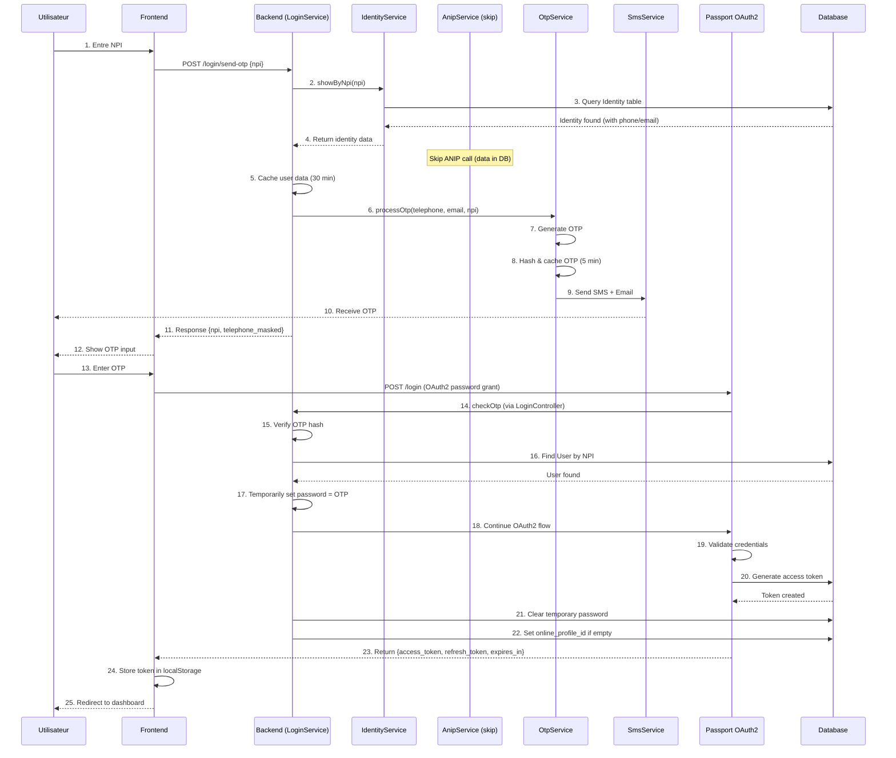
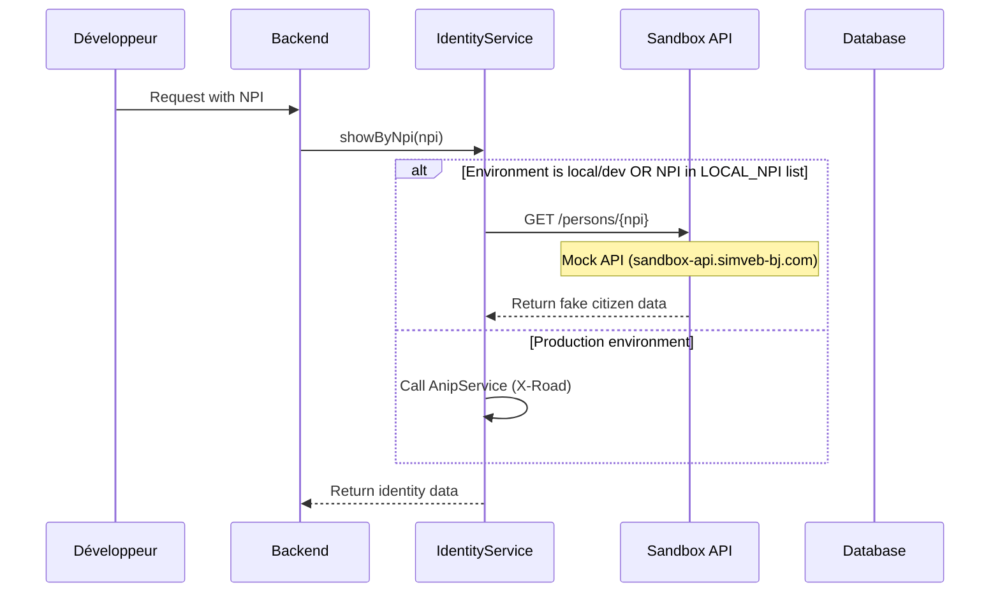

# Documentation Complète : Intégration ANIP pour l'Authentification NPI

## Table des Matières

1. [Vue d'ensemble](#vue-densemble)
2. [Architecture du système](#architecture-du-système)
3. [Flux d'authentification détaillé](#flux-dauthentification-détaillé)
4. [Implémentation technique](#implémentation-technique)
5. [Intégration X-Road](#intégration-x-road)
6. [Configuration et déploiement](#configuration-et-déploiement)
7. [Sécurité](#sécurité)
8. [Tests et debugging](#tests-et-debugging)
9. [Troubleshooting](#troubleshooting)

---

## Vue d'ensemble

### Qu'est-ce que ANIP ?

**ANIP (Agence Nationale d'Identification des Personnes)** est l'organisme gouvernemental béninois responsable de la gestion du système d'identification nationale. ANIP maintient le **RNP (Registre National des Personnes)** qui contient les données d'identité de tous les citoyens béninois.

### Qu'est-ce que le NPI ?

Le **NPI (Numéro Personnel d'Identification)** est un identifiant unique à 10 chiffres attribué à chaque citoyen béninois. Il sert de clé primaire pour identifier de manière unique un citoyen dans tous les systèmes gouvernementaux.

**Format :** `XXXXXXXXXX` (10 chiffres)
**Exemple :** `4811676017`

### Objectifs de l'intégration

L'intégration ANIP dans SIMVEB permet de :

1. **Authentifier les citoyens** en utilisant leur NPI comme identifiant principal
2. **Vérifier l'identité** en temps réel auprès de la source gouvernementale officielle
3. **Récupérer automatiquement** les données d'identité (nom, prénom, date de naissance, adresse, téléphone, email)
4. **Éviter la fraude d'identité** en validant chaque utilisateur contre le RNP
5. **Simplifier l'expérience utilisateur** : pas besoin de saisir manuellement les informations personnelles

---

## Architecture du système

### Composants principaux

```
┌─────────────────┐
│  Frontend Web   │
│  (Nuxt 3/Vue)   │
└────────┬────────┘
         │ 1. POST /login/send-otp (npi)
         ▼
┌─────────────────────────────────────────────────────────┐
│           Backend Laravel (SIMVEB)                       │
│  ┌──────────────────────────────────────────────────┐  │
│  │  LoginController / RegisterController             │  │
│  └───────────────────┬──────────────────────────────┘  │
│                      │ 2. Call LoginService              │
│                      ▼                                   │
│  ┌──────────────────────────────────────────────────┐  │
│  │  LoginService / RegisterPersonService             │  │
│  └───────────────────┬──────────────────────────────┘  │
│                      │ 3. Call IdentityService           │
│                      ▼                                   │
│  ┌──────────────────────────────────────────────────┐  │
│  │  IdentityService                                  │  │
│  │  - Check local DB first                           │  │
│  │  - If not found, call AnipService                 │  │
│  └───────────────────┬──────────────────────────────┘  │
│                      │ 4. If identity not in DB          │
│                      ▼                                   │
│  ┌──────────────────────────────────────────────────┐  │
│  │  AnipService                                      │  │
│  │  - Build SOAP request (WSDL XML)                  │  │
│  │  - Send via X-Road                                │  │
│  └───────────────────┬──────────────────────────────┘  │
│                      │ 5. SOAP/XML request               │
└──────────────────────┼──────────────────────────────────┘
                       ▼
┌─────────────────────────────────────────────────────────┐
│              X-Road Security Server                      │
│  - Authentification mutuelle (TLS)                       │
│  - Signature numérique                                   │
│  - Chiffrement                                           │
│  - Logging centralisé                                    │
└───────────────────────┬─────────────────────────────────┘
                        │ 6. Secured SOAP request
                        ▼
┌─────────────────────────────────────────────────────────┐
│              ANIP RNP Database                           │
│  - Registre National des Personnes                       │
│  - Service: CITIZEN_BY_NPI_LITE                          │
└───────────────────────┬─────────────────────────────────┘
                        │ 7. SOAP response with citizen data
                        ▼
                   (Response flows back through same path)
```

### Technologies utilisées

| Composant | Technologie | Version |
|-----------|-------------|---------|
| Backend | Laravel | 10.x |
| HTTP Client | GuzzleHttp | 7.x |
| SOAP/XML | PHP DOM | Native |
| Cache | Redis | 7.x |
| Protocole d'échange | X-Road | 4.0 |
| Format de données | SOAP/XML | 1.1 |
| Authentification API | Laravel Passport (OAuth2) | 11.x |
| OTP | Bcrypt + Redis | - |

---

## Flux d'authentification détaillé

### Scénario 1 : Inscription d'un nouveau citoyen


### Scénario 2 : Connexion d'un utilisateur existant



### Scénario 3 : Environnement de développement (Bypass ANIP)



---

## Implémentation technique

### 1. AnipService - Service principal

**Fichier :** `app/Services/External/AnipService.php`

```php
<?php

namespace App\Services\External;

use DOMXPath;
use DOMDocument;
use GuzzleHttp\Client;
use Illuminate\Support\Str;
use Illuminate\Http\Response;
use Illuminate\Support\Facades\Log;

class AnipService
{
    private $httpClient;

    public function __construct()
    {
        // Désactive la vérification SSL (en production, utiliser un certificat valide)
        $this->httpClient = new Client(['verify' => false]);
    }

    /**
     * Récupère les informations d'un citoyen depuis ANIP via son NPI
     *
     * @param string $npi Numéro Personnel d'Identification (10 chiffres)
     * @return array|false Tableau des données du citoyen ou false si erreur
     */
    public function getPerson(string $npi): array|false
    {
        // 1. Charger le template WSDL et remplacer le placeholder {npi}
        $wdsl = Str::replaceFirst(
            '{npi}',
            $npi,
            file_get_contents(storage_path('wdsl/anip-person.xml'))
        );

        // 2. Envoyer la requête SOAP via X-Road
        $response = $this->httpClient->post(config('config.xroad_base_url'), [
            "body" => $wdsl,
            "headers" => [
                "Content-Type" => "text/xml;charset=utf-8",
                "SOAPAction" => "",
            ]
        ]);

        // 3. Traiter la réponse
        if ($response->getStatusCode() == Response::HTTP_OK) {
            $xmlResponse = $response->getBody()->getContents();
            $doc = new DOMDocument();
            $doc->loadXML($xmlResponse);
            $xpath = new DOMXPath($doc);

            // 4. Parser les données XML avec XPath
            return [
                "npi" => $xpath->query("//ns:CITIZEN_BY_NPI_LITEResponse/NPI")->item(0)?->nodeValue,
                "lastname" => $xpath->query("//ns:CITIZEN_BY_NPI_LITEResponse/LASTNAME")->item(0)?->nodeValue,
                "firstname" => $xpath->query("//ns:CITIZEN_BY_NPI_LITEResponse/FIRSTNAME")->item(0)?->nodeValue,
                "maritalname" => $xpath->query("//ns:CITIZEN_BY_NPI_LITEResponse/MARITALNAME")->item(0)?->nodeValue,
                "birthdate" => $xpath->query("//ns:CITIZEN_BY_NPI_LITEResponse/BIRTHDATE")->item(0)?->nodeValue,
                "birth_country_code" => $xpath->query("//ns:CITIZEN_BY_NPI_LITEResponse/BIRTH_COUNTRY_CODE")->item(0)?->nodeValue,
                "birth_place" => $xpath->query("//ns:CITIZEN_BY_NPI_LITEResponse/BIRTH_PLACE")->item(0)?->nodeValue,
                "residence_country_code" => $xpath->query("//ns:CITIZEN_BY_NPI_LITEResponse/RESIDENCE_COUNTRY_CODE")->item(0)?->nodeValue,
                "residence_department" => $xpath->query("//ns:CITIZEN_BY_NPI_LITEResponse/RESIDENCE_DEPARTMENT")->item(0)?->nodeValue,
                "residence_town" => $xpath->query("//ns:CITIZEN_BY_NPI_LITEResponse/RESIDENCE_TOWN")->item(0)?->nodeValue,
                "residence_district" => $xpath->query("//ns:CITIZEN_BY_NPI_LITEResponse/RESIDENCE_DISTRICT")->item(0)?->nodeValue,
                "residence_village" => $xpath->query("//ns:CITIZEN_BY_NPI_LITEResponse/RESIDENCE_VILLAGE")->item(0)?->nodeValue,
                "residence_address" => $xpath->query("//ns:CITIZEN_BY_NPI_LITEResponse/RESIDENCE_ADDRESS")->item(0)?->nodeValue,
                "phone_number" => $xpath->query("//ns:CITIZEN_BY_NPI_LITEResponse/PHONE_NUMBER")->item(0)?->nodeValue,
                "email" => $xpath->query("//ns:CITIZEN_BY_NPI_LITEResponse/EMAIL")->item(0)?->nodeValue,
                "nationality" => $xpath->query("//ns:CITIZEN_BY_NPI_LITEResponse/NATIONALITY")->item(0)?->nodeValue,
                "sexe" => $xpath->query("//ns:CITIZEN_BY_NPI_LITEResponse/SEXE")->item(0)?->nodeValue,
                "phone_number_indicatif" => $xpath->query("//ns:CITIZEN_BY_NPI_LITEResponse/PHONE_NUMBER_INDICATIF")->item(0)?->nodeValue,
            ];
        } else {
            // 5. Logger l'erreur
            Log::info('------------------ ANIP ERROR ---------------------------');
            Log::info($response->getStatusCode() . " | ".$response->getBody()->getContents());
            Log::info('------------------ ANIP ERROR ---------------------------');
        }

        return false;
    }
}
```

**Points clés :**

1. **GuzzleHttp** : Utilisé pour effectuer les requêtes HTTP POST
2. **WSDL Template** : Fichier XML pré-formaté où seul le NPI est remplacé dynamiquement
3. **DOMXPath** : Parser XML natif PHP pour extraire les données de la réponse SOAP
4. **Error Handling** : Log les erreurs pour faciliter le debugging
5. **SSL Verify** : Désactivé ici (à activer en production avec certificats valides)

---

### 2. IdentityService - Couche d'abstraction

**Fichier :** `app/Services/IdentityService.php`

```php
public function showByNpi(string $npi)
{
    try {
        // 1. Vérifier d'abord la base de données locale
        $identity = Identity::where('npi', $npi)->first();

        if ($identity) {
            // Données déjà en cache local
            return new IdentityResource($identity);
        } else {
            // 2. Appeler ANIP ou Sandbox selon l'environnement
            if (app()->environment('local') ||
                app()->environment('dev') ||
                in_array($npi, Utils::LOCAL_NPI)) {

                // Environnement de développement : utiliser Sandbox
                $response = Http::get(
                    config('app.sandbox_host') . '/persons/' . $npi
                )->json();

            } else {
                // Production : appeler ANIP via X-Road
                $response = (new AnipService)->getPerson($npi);
            }

            return new IdentityResource($response, 'api');
        }
    } catch (\Exception $exception) {
        DB::rollBack();
        Log::debug($exception);
        abort(ResponseAlias::HTTP_INTERNAL_SERVER_ERROR, __('errors.server_error'));
    }
}
```

**Stratégie de cache à deux niveaux :**

1. **Cache permanent (DB)** : Table `identities` stocke les données ANIP après la première requête
2. **Cache temporaire (Redis)** : Données OTP et données utilisateur en cours d'inscription (30 min)

**Avantages :**
- Réduit les appels à ANIP (coût/latence)
- Améliore les performances
- Fonctionne même si ANIP est indisponible temporairement

---

### 3. LoginService - Gestion de l'authentification

**Fichier :** `ntech-libs/users-package/src/Services/Auth/LoginService.php`

```php
public function sendOtp(array $data)
{
    try {
        // 1. Récupérer les données du citoyen via IdentityService
        $retrievePerson = (new IdentityService)
            ->showByNpi($data['npi'])
            ->response()
            ->getData(true)['data'];

    } catch (\Illuminate\Http\Client\ConnectionException $e) {
        Log::error($e);
        throw new UnexceptedErrorException;
    }

    // 2. Vérifier que le NPI existe
    if (!isset($retrievePerson['npi'])) {
        return [false, [
            'message' => 'Ce NPI n\'est pas reconnu.',
            'code' => ResponseAlias::HTTP_NOT_FOUND
        ]];
    }

    // 3. Préparer les données
    $userData = $retrievePerson;

    // 4. Mettre en cache (30 minutes)
    updateOrRememberCache($data['npi'] . '-user-data', (60 * 30), [
        'npi' => $userData['npi'],
        'telephone' => $userData['telephone'],
        'email' => $userData['email'],
    ]);

    // 5. Générer et envoyer l'OTP
    $this->otpService->processOtp(
        canal: 'sms',
        npi: $userData['npi'],
        telephone: $userData['telephone'],
        email: $userData['email'],
        smsPurpose: 'Votre mot de passe de connexion à SIMVEB est : ',
        emailPurpose: 'Pour vous connecter à SIMVEB'
    );

    // 6. Retourner la réponse
    return [
        true,
        [
            'npi' => $data['npi'],
            'telephone' => maskTelephone($userData['telephone']),
            'otp_duration' => getMetaValue(MetaDataKeys::otp_duration->name),
            'message' => __('auth.otp_sent_on_phone_number'),
        ]
    ];
}
```

---

### 4. OtpService - Génération et envoi d'OTP

**Fichier :** `ntech-libs/users-package/src/Services/Auth/OtpService.php`

```php
public function processOtp(
    string $canal = 'sms',
    string $telephone = '',
    string $email = '',
    string $npi = '',
    string $ifu = '',
    string $emailPurpose = '',
    string $smsPurpose = ''
) {
    // 1. Générer l'OTP (4 chiffres)
    // En dev/staging : toujours '1234' pour faciliter les tests
    $otp = in_array(app()->env, ['local', 'dev', 'development', 'staging']) ||
           in_array($npi, Utils::LOCAL_NPI)
        ? '1234'
        : str_pad(rand(1, 9999), 4, '0', STR_PAD_LEFT);

    // 2. Hasher l'OTP avec bcrypt
    $otpData['otp'] = Hash::make($otp);

    // 3. Associer au NPI ou IFU
    if ($canal == 'sms' && $npi) {
        $otpData['npi'] = $npi;
    } elseif ($canal == 'email' && $ifu) {
        $otpData['ifu'] = $ifu;
    }

    // 4. Stocker en cache Redis (clé basée sur l'IP)
    $key = request()->ip() . '-one-time-password';
    updateOrRememberCache(
        $key,
        (60 * getMetaValue(MetaDataKeys::otp_duration->name)),
        $otpData
    );

    // 5. Préparer les données de notification
    $notifData = [
        'purpose' => $emailPurpose ?? 'Pour poursuivre l\'enregistrement',
        'otp' => $otp,
        'time' => 5
    ];

    // 6. Envoyer SMS (si pas en dev)
    if ($canal == 'sms' && !in_array(app()->env, ['local', 'dev', 'development', 'staging'])) {
        $message = $smsPurpose ?? 'Pour poursuivre l\'enregistrement ';
        $message .= $otp;
        (new SmsService)->send($telephone, $message);
    }

    // 7. Envoyer Email (si pas en dev)
    if (!in_array(app()->env, ['local', 'dev', 'development', 'staging'])) {
        sendMail(
            $email,
            null,
            NotificationNames::OTP_VERIFICATION,
            $notifData
        );
    }
}
```

**Sécurité OTP :**
- **Durée de vie** : 5 minutes (configurable via metadata)
- **Hashage** : bcrypt (pas de stockage en clair)
- **Clé de cache** : Basée sur l'IP pour éviter les tentatives multiples
- **Limitation** : Un seul OTP actif par IP
- **Environnement de test** : OTP fixe `1234` pour faciliter les tests

---

### 5. RegisterPersonService - Inscription

**Fichier :** `ntech-libs/users-package/src/Services/Auth/RegisterPersonService.php`

```php
public function store(array $data)
{
    // 1. Récupérer les données depuis le cache
    $userData = Cache::get($data['npi'] . '-user-data');

    if (!$userData) {
        return [false, [
            'message' => __('auth.information_cache_timeout'),
            'code' => ResponseAlias::HTTP_REQUEST_TIMEOUT
        ]];
    }

    DB::beginTransaction();
    try {
        // 2. Créer l'Identity
        $identity = (new IdentityRepository)->create($userData + $data);

        // 3. Créer l'User
        $user = (new UserRepository)->create([
            'identity_id' => $identity->id,
            'email' => $userData['email'],
            'username' => $data['npi'], // NPI = username
        ]);

        // 4. Créer le Profile (type: user)
        $user->profiles()->create([
            'type_id' => ProfileType::where('code', ProfileTypesEnum::user->name)
                ->first()->id,
            'identity_id' => $identity->id,
        ]);

        // 5. Envoyer notification de succès
        if (!in_array(app()->env, ['local', 'dev', 'development', 'staging'])) {
            sendNotification(
                NotificationNames::REGISTRATION_SUCCESSFUL,
                $identity,
                [
                    'link' => [
                        'text' => 'Connexion',
                        'url' => config('app.portal_url') . '/auth/login',
                    ]
                ],
                ['mail', 'sms']
            );
        }

        DB::commit();

        // 6. Nettoyer le cache
        Cache::forget($data['npi'] . '-user-data');

        return [true, ['message' => 'Inscription réussie.']];

    } catch (\Exception $exception) {
        DB::rollBack();
        Log::debug($exception);
        throw new UnexceptedErrorException;
    }
}
```

**Processus transactionnel :**
1. Identity → 2. User → 3. Profile
2. Si une étape échoue, tout est annulé (rollback)
3. Cache nettoyé après succès

---

## Intégration X-Road

### Qu'est-ce que X-Road ?

**X-Road** est un middleware d'échange de données sécurisé développé par l'Estonie. Il est utilisé par plusieurs gouvernements (Estonie, Finlande, Bénin, etc.) pour permettre l'interopérabilité entre systèmes gouvernementaux.

**Caractéristiques :**
- Authentification mutuelle (TLS)
- Signature numérique de chaque message
- Chiffrement de bout en bout
- Logging centralisé et auditable
- Non-répudiation

### Architecture X-Road pour SIMVEB

```
┌──────────────┐         ┌──────────────────┐         ┌──────────────┐
│   SIMVEB     │◄───────►│  X-Road Security │◄───────►│  ANIP RNP    │
│   Backend    │   TLS   │     Server       │   TLS   │   Service    │
└──────────────┘         └──────────────────┘         └──────────────┘
      │                           │                           │
      │                           │                           │
  Subsystem:              Authenticated              Subsystem:
  BJ/GOV/ANATT/SIMVEB     & Signed Messages          BJ/GOV/ANIP/RNP
```

### Structure de la requête SOAP X-Road

**Fichier :** `wdsl/anip-person.xml`

```xml
<soapenv:Envelope
    xmlns:soapenv="http://schemas.xmlsoap.org/soap/envelope/"
    xmlns:xro="http://x-road.eu/xsd/xroad.xsd"
    xmlns:iden="http://x-road.eu/xsd/identifiers"
    xmlns:ns="http://x-road.eu/xsd/connector/CITIZEN_BY_NPI_LITE/0.0.1">

   <soapenv:Header>
      <!-- Client : SIMVEB (ANATT) -->
      <xro:client iden:objectType="SUBSYSTEM">
         <iden:xRoadInstance>BJ</iden:xRoadInstance>
         <iden:memberClass>GOV</iden:memberClass>
         <iden:memberCode>ANATT</iden:memberCode>
         <iden:subsystemCode>SIMVEB</iden:subsystemCode>
      </xro:client>

      <!-- Service : ANIP RNP -->
      <xro:service iden:objectType="SERVICE">
         <iden:xRoadInstance>BJ</iden:xRoadInstance>
         <iden:memberClass>GOV</iden:memberClass>
         <iden:memberCode>ANIP</iden:memberCode>
         <iden:subsystemCode>RNP</iden:subsystemCode>
         <iden:serviceCode>CITIZEN_BY_NPI_LITE</iden:serviceCode>
         <iden:serviceVersion>v1</iden:serviceVersion>
      </xro:service>

      <!-- Metadata -->
      <xro:userId>?</xro:userId>
      <xro:id>?</xro:id>
      <xro:protocolVersion>4.0</xro:protocolVersion>
   </soapenv:Header>

   <soapenv:Body>
      <ns:CITIZEN_BY_NPI_LITE>
         <NPI>{npi}</NPI> <!-- Remplacé dynamiquement -->
      </ns:CITIZEN_BY_NPI_LITE>
   </soapenv:Body>
</soapenv:Envelope>
```

**Éléments clés :**

| Élément | Valeur | Description |
|---------|--------|-------------|
| `xRoadInstance` | BJ | Instance X-Road du Bénin |
| `memberClass` | GOV | Classe : Gouvernement |
| `client/memberCode` | ANATT | Code membre : Agence Nationale des Transports Terrestres |
| `client/subsystemCode` | SIMVEB | Sous-système appelant |
| `service/memberCode` | ANIP | Code membre : ANIP |
| `service/subsystemCode` | RNP | Sous-système : Registre National des Personnes |
| `serviceCode` | CITIZEN_BY_NPI_LITE | Nom du service |
| `serviceVersion` | v1 | Version du service |
| `protocolVersion` | 4.0 | Version du protocole X-Road |

### Format de la réponse SOAP

**Fichier exemple :** `wdsl/anip-response.xml`

```xml
<soapenv:Envelope ...>
    <soapenv:Header>
        <xro:requestHash algorithmId="http://www.w3.org/2001/04/xmlenc#sha512">
            fM8/y1AaqBGDUhsK5GlnEKXV/MFm881GJeobOHOHup+GwD5O+EQp+P6xaIIJ+nV3VH+GhMmfYziV7+H5pSDvzA==
        </xro:requestHash>
    </soapenv:Header>

    <soapenv:Body>
        <ns:CITIZEN_BY_NPI_LITEResponse>
            <NPI>4811676017</NPI>
            <LASTNAME>FATAOU</LASTNAME>
            <FIRSTNAME>MASSOUD KOLAWOLE</FIRSTNAME>
            <MARITALNAME></MARITALNAME>
            <BIRTHDATE>2001-11-04T00:00:00</BIRTHDATE>
            <BIRTH_COUNTRY_CODE>GAB</BIRTH_COUNTRY_CODE>
            <BIRTH_PLACE>MOANOA</BIRTH_PLACE>
            <RESIDENCE_COUNTRY_CODE>BEN</RESIDENCE_COUNTRY_CODE>
            <RESIDENCE_DEPARTMENT>OUEME</RESIDENCE_DEPARTMENT>
            <RESIDENCE_TOWN>PORTO-NOVO</RESIDENCE_TOWN>
            <RESIDENCE_DISTRICT>4EME ARRONDISSEMENT</RESIDENCE_DISTRICT>
            <RESIDENCE_VILLAGE>HLOGOU OU HLONGOU</RESIDENCE_VILLAGE>
            <RESIDENCE_ADDRESS>C/SB M/FATAOU</RESIDENCE_ADDRESS>
            <PHONE_NUMBER>51104856</PHONE_NUMBER>
            <EMAIL></EMAIL>
            <NATIONALITY>BEN</NATIONALITY>
            <SEXE>M</SEXE>
            <PHONE_NUMBER_INDICATIF>+229</PHONE_NUMBER_INDICATIF>
        </ns:CITIZEN_BY_NPI_LITEResponse>
    </soapenv:Body>
</soapenv:Envelope>
```

**Données retournées :**

| Champ | Type | Exemple | Description |
|-------|------|---------|-------------|
| `NPI` | string(10) | 4811676017 | Numéro Personnel d'Identification |
| `LASTNAME` | string | FATAOU | Nom de famille |
| `FIRSTNAME` | string | MASSOUD KOLAWOLE | Prénom(s) |
| `MARITALNAME` | string | | Nom marital (si applicable) |
| `BIRTHDATE` | datetime | 2001-11-04T00:00:00 | Date de naissance |
| `BIRTH_COUNTRY_CODE` | string(3) | GAB | Code ISO3 du pays de naissance |
| `BIRTH_PLACE` | string | MOANOA | Lieu de naissance |
| `RESIDENCE_COUNTRY_CODE` | string(3) | BEN | Code ISO3 du pays de résidence |
| `RESIDENCE_DEPARTMENT` | string | OUEME | Département de résidence |
| `RESIDENCE_TOWN` | string | PORTO-NOVO | Ville de résidence |
| `RESIDENCE_DISTRICT` | string | 4EME ARRONDISSEMENT | Arrondissement |
| `RESIDENCE_VILLAGE` | string | HLOGOU OU HLONGOU | Village/Quartier |
| `RESIDENCE_ADDRESS` | string | C/SB M/FATAOU | Adresse complète |
| `PHONE_NUMBER` | string | 51104856 | Numéro de téléphone (sans indicatif) |
| `PHONE_NUMBER_INDICATIF` | string | +229 | Indicatif téléphonique |
| `EMAIL` | string | | Adresse email (souvent vide) |
| `NATIONALITY` | string(3) | BEN | Nationalité (code ISO3) |
| `SEXE` | string(1) | M | Sexe (M/F) |

---

## Configuration et déploiement

### Variables d'environnement

**Fichier :** `.env`

```bash
# X-Road Configuration
XROAD_BASE_URL=https://xroad-server.gouv.bj/r1/BJ/GOV/ANATT/SIMVEB

# Sandbox API (pour dev/staging)
APP_SANDBOX_HOST=https://sandbox-api.simveb-bj.com

# OTP Configuration
OTP_DURATION=5  # minutes

# SMS Configuration
SMS_DRIVER=wirepick
WIREPICK_HOST=https://apisms.wirepick.com/
WIREPICK_USER=your_username
WIREPICK_PASSWORD=your_password
WIREPICK_SENDER_ID=SIMVEB

# Email Configuration (Novu)
NOVU_API_KEY=your_novu_api_key

# Redis Cache
REDIS_HOST=127.0.0.1
REDIS_PASSWORD=null
REDIS_PORT=6379

# Environnement
APP_ENV=production  # local, dev, staging, production
```

### Configuration Laravel

**Fichier :** `config/config.php`

```php
return [
    'xroad_base_url' => env('XROAD_BASE_URL'),

    // Sandbox pour environnements de dev
    'check_npi_url' => env(
        'CHECK_NPI_URL',
        'https://sandbox-api.simveb-bj.com/api/persons'
    ),

    // Configuration SMS
    'sms' => [
        'driver' => env('SMS_DRIVER', 'wirepick'),
    ],

    'wirepick' => [
        'host' => env('WIREPICK_HOST', 'https://apisms.wirepick.com/'),
        'user' => env('WIREPICK_USER', ''),
        'password' => env('WIREPICK_PASSWORD', ''),
        'senderId' => env('WIREPICK_SENDER_ID', 'SIMVEB')
    ],
];
```

### Déploiement

#### Prérequis

1. **Serveur X-Road :**
   - Certificat TLS valide
   - Configuration du subsystem SIMVEB
   - Whitelist IP du serveur backend

2. **Backend Laravel :**
   - PHP 8.1+
   - Extensions : dom, xml, mbstring, openssl
   - Redis server
   - Composer

3. **Services externes :**
   - Compte SMS (Wirepick/Vonage)
   - Compte Email (Novu)

#### Étapes de déploiement

```bash
# 1. Cloner le projet
git clone https://github.com/your-org/simveb-backend.git
cd simveb-backend

# 2. Installer les dépendances
composer install --no-dev --optimize-autoloader

# 3. Configurer l'environnement
cp .env.example .env
php artisan key:generate

# 4. Configurer les variables (voir section précédente)
nano .env

# 5. Migrer la base de données
php artisan migrate --force

# 6. Seed les données de base
php artisan db:seed --class=AuthConfigSeeder

# 7. Optimiser pour la production
php artisan config:cache
php artisan route:cache
php artisan view:cache

# 8. Configurer les permissions
chmod -R 775 storage bootstrap/cache
chown -R www-data:www-data storage bootstrap/cache

# 9. Redémarrer les services
systemctl restart php8.1-fpm
systemctl restart nginx
systemctl restart redis-server
```

---

## Sécurité

### Mesures de sécurité implémentées

#### 1. Authentification multi-facteurs (OTP)

- **Durée limitée** : 5 minutes
- **Usage unique** : OTP invalidé après utilisation
- **Hashage** : bcrypt (cost 10)
- **Rate limiting** : Un OTP par IP toutes les 5 minutes

#### 2. Protection CSRF

```php
// Middleware automatique Laravel
\App\Http\Middleware\VerifyCsrfToken::class,
```

#### 3. HTTPS obligatoire

```php
// AppServiceProvider
if (app()->environment('production')) {
    URL::forceScheme('https');
}
```

#### 4. Rate Limiting API

```php
// routes/api.php
Route::middleware(['throttle:login'])->group(function () {
    Route::post('/login/send-otp', [LoginController::class, 'sendOtp']);
});

// app/Providers/RouteServiceProvider.php
RateLimiter::for('login', function (Request $request) {
    return Limit::perMinute(5)->by($request->ip());
});
```

#### 5. Validation des entrées

```php
// Http/Requests/Login/SendOtpRequest.php
public function rules()
{
    return [
        'npi' => ['required', 'string', 'regex:/^[0-9]{10}$/', 'exists:users,username'],
    ];
}
```

#### 6. Protection contre les injections XML

```php
// AnipService.php
$doc = new DOMDocument();
$doc->loadXML($xmlResponse, LIBXML_NONET | LIBXML_NOENT | LIBXML_NOCDATA);
```

#### 7. Logging et audit

```php
// Tous les appels ANIP sont loggés
Log::channel('anip')->info('ANIP Request', [
    'npi' => $npi,
    'ip' => request()->ip(),
    'user_agent' => request()->userAgent(),
    'timestamp' => now(),
]);
```

### Recommandations supplémentaires

1. **Activer la vérification SSL en production :**

```php
// AnipService.php
$this->httpClient = new Client([
    'verify' => env('APP_ENV') === 'production',
    'cert' => env('XROAD_CLIENT_CERT'),
    'ssl_key' => env('XROAD_CLIENT_KEY'),
]);
```

2. **Implémenter un système de détection de fraude :**

```php
// Exemple : bloquer après 3 tentatives échouées
if (LoginAttempt::where('ip', request()->ip())
    ->where('created_at', '>', now()->subHour())
    ->count() >= 3) {

    throw new TooManyAttemptsException();
}
```

3. **Chiffrer les données sensibles en base de données :**

```php
// Model Identity
protected $casts = [
    'phone_number' => 'encrypted',
    'email' => 'encrypted',
];
```

---

## Tests et debugging

### Tests manuels avec Artisan Command

```bash
# Tester l'appel ANIP
php artisan test:anip --npi=4811676017

# Résultat attendu :
npi => 4811676017
lastname => FATAOU
firstname => MASSOUD KOLAWOLE
birthdate => 2001-11-04T00:00:00
...
```

**Code du test :**

```php
// app/Console/Commands/TestAnipCommand.php
public function handle()
{
    $npi = $this->option('npi');

    if (!$npi) {
        $this->error("NPI is required!");
        return false;
    }

    $anipService = new AnipService();
    $result = $anipService->getPerson($npi);

    foreach ($result as $key => $value) {
        $this->info($key ." => ".$value);
    }

    return 1;
}
```

### Tests unitaires avec PHPUnit

**Fichier :** `tests/Feature/AnipIntegrationTest.php`

```php
<?php

namespace Tests\Feature;

use Tests\TestCase;
use App\Services\External\AnipService;
use Illuminate\Foundation\Testing\RefreshDatabase;

class AnipIntegrationTest extends TestCase
{
    public function test_can_fetch_citizen_from_anip()
    {
        $anipService = new AnipService();
        $result = $anipService->getPerson('4811676017');

        $this->assertIsArray($result);
        $this->assertArrayHasKey('npi', $result);
        $this->assertEquals('4811676017', $result['npi']);
        $this->assertNotEmpty($result['firstname']);
        $this->assertNotEmpty($result['lastname']);
    }

    public function test_returns_false_for_invalid_npi()
    {
        $anipService = new AnipService();
        $result = $anipService->getPerson('0000000000');

        $this->assertFalse($result);
    }

    public function test_identity_service_uses_cache()
    {
        // First call: should hit ANIP
        $identity1 = (new \App\Services\IdentityService)
            ->showByNpi('4811676017');

        // Second call: should use DB cache
        $identity2 = (new \App\Services\IdentityService)
            ->showByNpi('4811676017');

        // Both should return same data
        $this->assertEquals(
            $identity1->response()->getData(),
            $identity2->response()->getData()
        );
    }
}
```

**Exécuter les tests :**

```bash
# Tous les tests
php artisan test

# Tests spécifiques ANIP
php artisan test --filter=AnipIntegration

# Avec coverage
php artisan test --coverage
```

### Debugging avec Logs

**Configuration du logging :**

```php
// config/logging.php
'channels' => [
    'anip' => [
        'driver' => 'daily',
        'path' => storage_path('logs/anip.log'),
        'level' => 'debug',
        'days' => 14,
    ],
],
```

**Ajouter des logs dans AnipService :**

```php
public function getPerson(string $npi): array|false
{
    Log::channel('anip')->info('ANIP Request Started', [
        'npi' => $npi,
        'ip' => request()->ip(),
    ]);

    $wdsl = Str::replaceFirst('{npi}', $npi,
        file_get_contents(storage_path('wdsl/anip-person.xml'))
    );

    Log::channel('anip')->debug('SOAP Request', ['xml' => $wdsl]);

    $response = $this->httpClient->post(config('config.xroad_base_url'), [
        "body" => $wdsl,
        "headers" => [
            "Content-Type" => "text/xml;charset=utf-8",
            "SOAPAction" => "",
        ]
    ]);

    Log::channel('anip')->debug('SOAP Response', [
        'status' => $response->getStatusCode(),
        'body' => $response->getBody()->getContents(),
    ]);

    // ... reste du code
}
```

**Consulter les logs :**

```bash
# Logs ANIP
tail -f storage/logs/anip.log

# Logs Laravel
tail -f storage/logs/laravel.log
```

### Debugging avec Postman

**Collection Postman :**

```json
{
  "info": {
    "name": "SIMVEB ANIP Integration",
    "schema": "https://schema.getpostman.com/json/collection/v2.1.0/collection.json"
  },
  "item": [
    {
      "name": "1. Send OTP (Login)",
      "request": {
        "method": "POST",
        "header": [
          {
            "key": "Accept",
            "value": "application/json"
          }
        ],
        "body": {
          "mode": "raw",
          "raw": "{\n    \"npi\": \"4811676017\"\n}",
          "options": {
            "raw": {
              "language": "json"
            }
          }
        },
        "url": {
          "raw": "{{base_url}}/api/login/send-otp",
          "host": ["{{base_url}}"],
          "path": ["api", "login", "send-otp"]
        }
      }
    },
    {
      "name": "2. Check OTP (Login)",
      "request": {
        "method": "POST",
        "header": [],
        "body": {
          "mode": "urlencoded",
          "urlencoded": [
            {
              "key": "grant_type",
              "value": "password"
            },
            {
              "key": "client_id",
              "value": "{{client_id}}"
            },
            {
              "key": "client_secret",
              "value": "{{client_secret}}"
            },
            {
              "key": "username",
              "value": "4811676017"
            },
            {
              "key": "password",
              "value": "1234"
            }
          ]
        },
        "url": {
          "raw": "{{base_url}}/api/login",
          "host": ["{{base_url}}"],
          "path": ["api", "login"]
        }
      }
    }
  ],
  "variable": [
    {
      "key": "base_url",
      "value": "http://localhost:8000"
    },
    {
      "key": "client_id",
      "value": "YOUR_CLIENT_ID"
    },
    {
      "key": "client_secret",
      "value": "YOUR_CLIENT_SECRET"
    }
  ]
}
```

---

## Troubleshooting

### Problèmes courants

#### 1. Erreur : "Ce NPI n'est pas reconnu"

**Cause :** Le NPI n'existe pas dans la base ANIP.

**Solutions :**
```bash
# Vérifier que le NPI est valide (10 chiffres)
php artisan test:anip --npi=XXXXXXXXXX

# En dev, utiliser un NPI de test
# Ajouter dans app/Consts/Utils.php :
const LOCAL_NPI = ['1234567890', '0987654321'];
```

#### 2. Erreur : "Connection timeout"

**Cause :** Impossible de joindre le serveur X-Road.

**Solutions :**
```bash
# Vérifier la connectivité
curl -v https://xroad-server.gouv.bj/r1/BJ/GOV/ANATT/SIMVEB

# Vérifier le firewall
sudo ufw status
sudo ufw allow from YOUR_IP to any port 443

# Vérifier les logs X-Road
sudo tail -f /var/log/xroad/proxy.log
```

#### 3. Erreur : "SSL certificate problem"

**Cause :** Certificat SSL invalide ou auto-signé.

**Solutions :**
```php
// Temporairement en dev (JAMAIS en prod)
$this->httpClient = new Client(['verify' => false]);

// En production, utiliser le certificat
$this->httpClient = new Client([
    'verify' => '/path/to/ca-bundle.crt',
]);
```

#### 4. Erreur : "OTP expired"

**Cause :** L'OTP a expiré (> 5 minutes).

**Solutions :**
```bash
# Vérifier la durée OTP dans la config
php artisan tinker
>>> getMetaValue(\Ntech\MetadataPackage\Enums\MetaDataKeys::otp_duration->name);

# Augmenter si nécessaire
UPDATE metadata SET value = '10' WHERE key = 'otp_duration';

# Vérifier l'horloge du serveur
date
sudo ntpdate pool.ntp.org
```

#### 5. Erreur : "SOAP-ENV:Server - Internal Error"

**Cause :** Erreur côté ANIP.

**Solutions :**
```bash
# Vérifier les logs ANIP
tail -f storage/logs/anip.log

# Contacter l'équipe ANIP
# Fournir : timestamp, NPI, message d'erreur complet

# Vérifier que le service est actif
php artisan test:anip --npi=4811676017
```

#### 6. Erreur : "Too Many Attempts"

**Cause :** Rate limiting dépassé.

**Solutions :**
```bash
# Vérifier le rate limit
php artisan route:list | grep login

# Augmenter temporairement (dev seulement)
# RouteServiceProvider.php
RateLimiter::for('login', function (Request $request) {
    return Limit::perMinute(100)->by($request->ip());
});

# Ou désactiver en dev
Route::post('/login/send-otp', [LoginController::class, 'sendOtp'])
    ->withoutMiddleware('throttle:login');
```

### Monitoring en production

**Tableau de bord recommandé :**

```php
// Dashboard metrics
[
    'anip_calls_total' => DB::table('anip_logs')->count(),
    'anip_calls_success' => DB::table('anip_logs')->where('status', 200)->count(),
    'anip_calls_failed' => DB::table('anip_logs')->where('status', '!=', 200)->count(),
    'anip_avg_response_time' => DB::table('anip_logs')->avg('response_time'),
    'otp_sent_today' => Cache::get('otp_sent_' . now()->format('Y-m-d')),
    'new_users_today' => User::whereDate('created_at', today())->count(),
]
```

**Alertes à configurer :**

1. Taux d'erreur ANIP > 5%
2. Temps de réponse ANIP > 3 secondes
3. Échecs OTP > 10%
4. Tentatives de connexion suspectes

---

## Annexes

### A. NPIs de test

Pour les environnements de développement :

| NPI | Nom | Prénom | Téléphone |
|-----|-----|--------|-----------|
| 1234567890 | TEST | User One | +22912345678 |
| 0987654321 | TEST | User Two | +22987654321 |
| 4811676017 | FATAOU | MASSOUD KOLAWOLE | +22951104856 |

### B. Codes d'erreur

| Code | Message | Action |
|------|---------|--------|
| 404 | NPI not found | Vérifier le NPI saisi |
| 408 | Request timeout | Vérifier connectivité X-Road |
| 429 | Too many requests | Attendre avant de réessayer |
| 500 | Internal server error | Vérifier logs backend |
| 502 | Bad gateway | Vérifier X-Road server |
| 503 | Service unavailable | ANIP temporairement indisponible |

### C. Glossaire

- **ANIP** : Agence Nationale d'Identification des Personnes
- **ANATT** : Agence Nationale des Transports Terrestres
- **DGI** : Direction Générale des Impôts
- **IFU** : Identifiant Fiscal Unique (pour les entreprises)
- **NPI** : Numéro Personnel d'Identification (pour les citoyens)
- **OTP** : One-Time Password (mot de passe à usage unique)
- **RNP** : Registre National des Personnes
- **SIMVEB** : Système d'Immatriculation des Véhicules du Bénin
- **SOAP** : Simple Object Access Protocol
- **WSDL** : Web Services Description Language
- **X-Road** : Middleware d'échange sécurisé

### D. Contacts et support

**Équipe SIMVEB :**
- Email : support@simveb-bj.com
- Téléphone : +229 XX XX XX XX

**Équipe ANIP (X-Road) :**
- Email : support-xroad@anip.bj
- Téléphone : +229 XX XX XX XX

**Documentation X-Road :**
- https://x-road.global/
- https://docs.x-road.global/

---

## Conclusion

L'intégration ANIP dans SIMVEB permet une authentification robuste et sécurisée basée sur le NPI. Le système utilise X-Road pour garantir la sécurité et la traçabilité des échanges, tout en offrant une expérience utilisateur fluide grâce au système OTP.

**Points clés à retenir :**

1. ✅ Authentification basée sur le NPI (identifiant national unique)
2. ✅ Vérification d'identité en temps réel via ANIP
3. ✅ Sécurité renforcée avec X-Road (TLS + signature numérique)
4. ✅ OTP à usage unique pour validation
5. ✅ Cache à deux niveaux (DB + Redis) pour performances
6. ✅ Mode sandbox pour développement
7. ✅ Logging et monitoring complets

**Prochaines étapes recommandées :**

1. Implémenter un système de MFA (TOTP) en complément de l'OTP SMS
2. Ajouter la reconnaissance biométrique (si ANIP le supporte)
3. Créer un tableau de bord de monitoring en temps réel
4. Implémenter un système de détection de fraude
5. Optimiser les performances avec un cache distribué (Redis Cluster)

---

**Version du document :** 1.0
**Date de création :** 2025-12-12
**Dernière mise à jour :** 2025-12-12
**Auteur :** Équipe Technique SIMVEB
